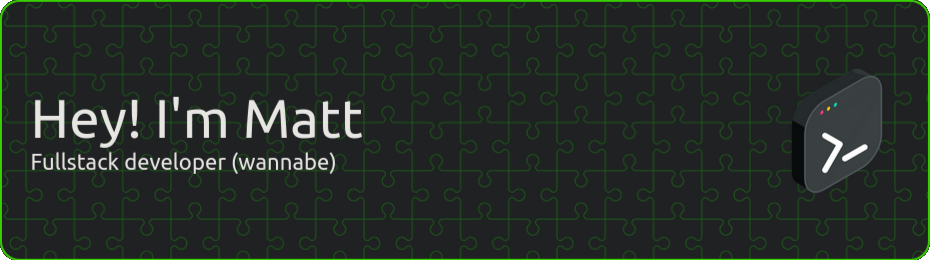

- 🔭 I’m currently working on:
  - [Litter](https://github.com/mchar7/litter), a Spring Boot-based (backend-only for now) API for a Twitter-like social media site.
  - Dovimux, a Python script to automate the remuxing and manipulation of Dolby Vision files.
  - Gek Tool, a suite of scripts (Python, Powershell, Batch) to streamline common Windows setup tasks.
- 🌱 I’m currently learning:
  - Terraform (and the Infrastructure as Code methodology, more generally)
  - Angular for frontend development (specifically to interact with a Spring backend)
