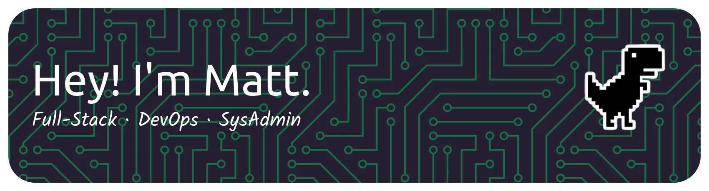

I work across full-stack development, DevOps, and Linux systems. CompSci
grad based in Ottawa.

### My stack

**Languages**

**Backend & data**

**Frontend**

**Infra & systems**

**AI / ML**

### Projects

- **Nohiki**: Personal Python platform of 18 async microservices with Kafka
  event streaming, multi-vector RAG on Qdrant, and an ML scoring pipeline
  pairing LightGBM with PydanticAI agents.
- **[Litter](https://github.com/mchar7/litter)** _(earlier work)_: Spring
  WebFlux reactive API with JWT/Argon2/OAuth2, reactive MongoDB, and Azure
  AKS deployment.

### At home

NixOS workstation, Dell PowerEdge homelab.
